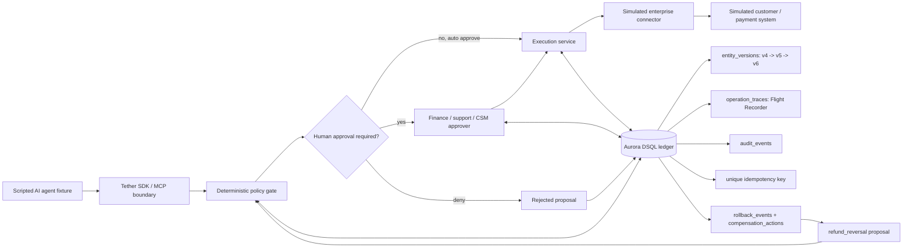

# Tether Architecture

## Built Scope

- Real: deterministic gate, approval lifecycle, execution, idempotency, versioned state, rollback, compensation, audit events, operation traces, and Aurora DSQL writes.
- Simulated: the AI agent and downstream enterprise/payment system.
- One action type flow: `issue_refund`, with `refund_reversal` as the compensation action.

## DSQL Design Notes

- UUID primary keys, no foreign keys.
- `json` columns, not `jsonb`.
- Every write transaction uses bounded retry for SQLSTATE `40001`.
- Concurrent proposal dedupe relies on the unique idempotency constraint/index and handles SQLSTATE `23505`.
- DSQL IAM auth uses `DsqlSigner.getDbConnectAdminAuthToken()` through an async `pg` password function so new connections receive fresh tokens.
- Mutations and their trace/audit rows are written atomically in the same transaction.
